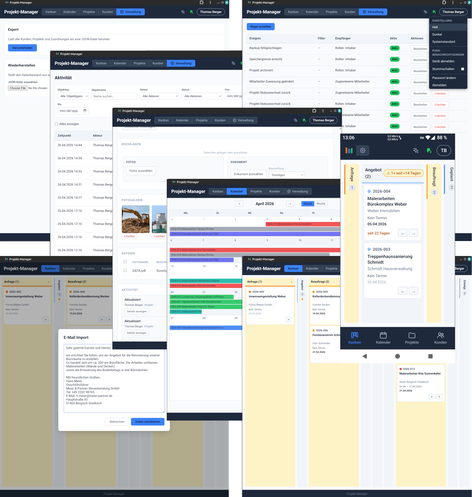

<!-- READ-ONLY for AI -->

# Projekt-Manager

A centralized system aimed at simplifying the lives of all stakeholders in a small, German-speaking "Handwerker" company, with two main goals:

- Make all processes, states and flows visible;
- Take over as much as possible from the manual processing of data - let everybody focus on their actual work.

Self-hosted, full control, fully customized, no BS.



Mobile PWA demo video: [vimeo.com/1186689273](https://vimeo.com/1186689273)

## Who is this for

_Owner_:

> "I need to have an overview of what is happening, which tasks need attention, what is stuck, how is the workflow moving and where are the Engpässe."

_Office worker_:

> "Same as owner, with even more details. I need to assign workers, manage attachments, organize projects, customers and data."

_Worker/s_:

> "I need to see what my planned work is, the details of my assigned projects and a straightforward way to report my progress, upload pictures, Aufmass, etc."

_All_:

> "I don't have either the time or the motivation to learn software, fight with menus, read special documentation, install and configure software, apps, etc. **I have work to do!**"

Thus, this project is oriented as follows:

- in terms of data, what does the person do?
- what does the person do manually, what of it can be automated?
- where does the person waste time and energy manually processing data?
- what view of the data is the person interested in (ditch all the rest)?

## Background and motivation

A company expanding beyond the trivial one-man-army operation with very few clients is faced with ever-increasing operational complexity of keeping track of multiple simultaneous tasks. There is only so much the head of the owner can hold at any time, and chaos follows.

Data flow becomes an increasingly bigger issue as well, with the prime example of sharing it over popular chat-apps.

At this point one is faced with a hard choice, usually involving over-bloated software, the need to readjust the company to the expectations of the software, too many or too few features, exploding costs, or even - all of these in some form. In the end, the friction is even bigger, the flow is still not fluid, vast amounts of manual processing of data are still required, now with the added bonus of the new costs. The requirement for everyone to install, configure and learn new software and apps does not help either.

To some degree, this is understandable, as the only way to really meet the exact needs of a specific company is to build the software from the ground up around these needs. Until very recently, this was unrealistic from a time/costs perspective, but now, with the ever-increasing productivity of LLMs, I was eager to see how far I can go.

For more on the background, see the [Kickoff](docs/project/kickoff.md) document.

## Data integrity, Security

Given that the software would handle real company data, the challenge lies in combining the productivity gains from modern LLMs with confidence in the security and data integrity.

Detailed information can be read in the designated documents. A basic overview of the approach can be summarized as follows:

> The app is treated as unreliable, both in terms of security and in preserving data integrity\*.

_The above scary statement actually lays the groundwork for decisions and workflows which may make the app even more reliable than other, "presumed-reliable" software._

### Security

- There is _no_ exposure to the open internet, as the whole deployment stays strictly behind a VPN (WireGuard). The only accessible ports are SSH and WireGuard. The WireGuard client onboarding is operator-driven - the app never sees the keys;
- HTTPS is enforced everywhere in deployment anyway;
- Business data is stored in encrypted form on the external object storage providers;
- Sensitive information is never stored unencrypted on disk. Deployment and server restart are operator-driven;
- Authentication is username + password, bcrypt-hashed under a NIST SP 800-63B policy with a local common-password blocklist; sessions are server-side records in Postgres (24h, `HttpOnly; Secure; SameSite=Strict`). Login is rate-limited;
- Authorization is two-layered: route-level RBAC across four roles (owner, office, worker, bookkeeper) and resource-level scoping enforced as SQL predicates - for example workers see only their assigned projects;
- Every domain-entity mutation goes through a single write path that records an audit log entry.

### Data

The business data is regarded in layers, each of which gets special attention:

1. App level data
   - Contains business data and binaries, eligible for import/export through the UI (currently no binaries can be imported this way).

2. DB dumps
   - Automatically exported to R2 at regular intervals - 4 times/daily on weekdays, 1/daily at weekends;
   - Regular automated drills check recoverability;
   - Object lock is enforced by the provider to prevent deleting for a set amount of days.

3. Object storage
   - Follows the same principle - provider-enforced object lock, provider-controlled lifecycle;
   - A "recycle-bin" concept: "deleting" a file only marks it for deletion, real deletion happens only through the provider after the set amount of days spent in the "bin". The app has no way of deleting data through a scoped API key.

### Risks and Tradeoffs

- Critical operations like deployment, restart and WireGuard onboarding are operator-driven. No operator available = outage. Accepted tradeoff;
- The system user for deployment has potentially root access through the Docker group. The user has access to the data anyway;
- A sweet spot for the automated backups is to be found, depending on the max acceptable time window for data loss;
- A regular, operator-driven recovery drill is a requirement - this should be a requirement for all software anyway.

## Workflow

This project makes heavy use of modern LLMs, mostly Claude Code. A "fully automated agentic workflow" is something I dislike, as I prefer to solve problems, instead of delegating them and hoping for the best. Thus, the workflow is as follows:

1. Gathering of data: exclusively human. Just speaking to people and watching what they do - who would have thought this might help in solving their problems...
2. Brainstorming a solution: time is a big factor here, as ideas tend to pop up. Agents and agent teams might be involved for critical discussion, research or real world solutions and technology, as well as scrutiny of the ideas;
3. Agentic orchestration with continuous human steering - see [Workflow](./CONTRIBUTING.md#workflow). Basically spec -> ACs -> tests -> implementation -> tests, with in-between checks and reviews through independent agents with adversarial framing. Separate reviews on the completed tasks, focusing on the project's guardrails and guidelines `./review/conventions-*.md`.
4. Presentation -> feedback -> readjustments. Everything in the project is regarded as WIP and it undergoes constant readjustments to the needs of the real users (not the other way around...)

## Navigation

- `docs/project/` - the vision document and the (constantly readjusted) plan;
- [ARCHITECTURE](./ARCHITECTURE.md) - navigation guide for the codebase;
- [CONTRIBUTING.md](./CONTRIBUTING.md) - workflow;
- [CLAUDE.md](./CLAUDE.md) - instructions for Claude Code. Includes categories of trust - human made | strict human control | AI made with less human control;
- `review/` - guardrails and guidelines, used when instructing agents on what to focus on;
- `docs/spec/` - specification;
- `docs/ops/` - runbooks with operator instructions;
- `docs/adr/` - bigger decisions with some background and rationale;
- `src/` - code. See the [module map](./ARCHITECTURE.md#module-map) for details.

## How to run

|               | [Local dev](#run-locally)    | [Full stack (HTTPS)](#run-in-production) |
| ------------- | ---------------------------- | ---------------------------------------- |
| App           | Node process (`npm run dev`) | Docker container                         |
| Reverse proxy | None (Vite proxies `/api/*`) | Caddy on port 443 (TLS)                  |
| DB + storage  | Docker                       | Docker                                   |
| Domain        | No                           | Yes                                      |
| TLS           | No                           | Yes (DNS-01 ACME)                        |
| VPN           | No                           | Yes (WireGuard)                          |
| Use case      | Development                  | Production                               |

### Run locally

**Prerequisites**:

- Docker and Docker Compose
- Node.js (pinned in `.nvmrc` - use `nvm install`)

**Running**:

```bash
# first time only:
nvm install                           # installs the Node.js version pinned in `.nvmrc`
cp .env.example .env                  # dev-ready, no edits needed
npm install
# run:
docker compose -f docker-compose.yml -f docker-compose.minio.yml -f docker-compose.dev.yml up -d db storage storage-init
npm run dev                           # starts backend + frontend at http://localhost:5173
```

**Seed Data**:

The `SEED` variable in `.env` controls database seeding on backend startup:

| Value             | Behavior                                                                                                   |
| ----------------- | ---------------------------------------------------------------------------------------------------------- |
| `true`            | Seed only if the database is empty. Data you create or change during development survives server restarts. |
| `force`           | Wipe all data and re-seed. Use when seed data structure changes or you need a clean slate.                 |
| `false` (default) | Don't seed.                                                                                                |

Seeding is always skipped in production (`NODE_ENV=production`).

Seed user list and credentials: [docs/ops/local-dev.md § Seed users](docs/ops/local-dev.md#seed-users).

### Run in production

Check `docs/ops` for the full runbook.

1. [Provision the server](docs/ops/server-setup.md) - hardened SSH, deploy user, ufw + fail2ban, Docker;
2. [Set up WireGuard](docs/ops/wireguard-setup.md) - VPN server up, Docker pinned to wait for `wg0` on boot;
3. [Configure DNS](docs/ops/dns-setup.md) - point the domain's A record at the WireGuard private IP, so it only resolves over VPN;
4. [Bootstrap TLS](docs/ops/caddy-tls-bootstrap.md) - first Let's Encrypt cert via DNS-01 ACME (staging -> production); interleaves with first deploy;
5. [Provision object storage](docs/ops/object-storage-provisioning.md) - Backblaze B2 bucket + capability-restricted app key + CORS rule (required for attachment uploads);
6. [Deploy](docs/ops/manual-deploy.md) - pull image from GHCR, start the stack, run first-admin bootstrap;
7. [Backups](docs/ops/backup/) - encrypted R2 backups + drills.

## Tests

Tests require the [local dev](#run-locally) setup (DB and MinIO exposed on host ports). They do not run against the full-stack Docker variants.

```bash
npm test             # unit + component tests (vitest)
npm run test:e2e     # Playwright E2E tests
```

First-time Playwright setup requires `npx playwright install` to download browser binaries.

## Current state and the road ahead

**State**

The project is considered a successful **MVP**, deployed and E2E-tested in a realistic environment behind VPN, accessible through a real domain from different devices, with users, roles and all the real workflows in place. All operator workflows were E2E-tested as well - backup, recovery, encryption, etc.

**Missing features**

Missing from the original goals, defined in the Kickoff, are invoices and the bookkeeper view - these turned out not to be required for the particular target case.

Also missing is the "Handbuch" - there are two reasons for this:

- the first is the obvious: the rapid adding of features and big changes makes dragging such an artifact around during dev a source of friction;
- the second is much more interesting - as it turned out during demonstrations, the app _does not need_ a Handbuch, which can fairly be considered a mark of success. The more such a document were needed, the less of a good job we would have done with the UX.

_Of course, when handing the installation over, a "Handbuch" will be present._

The UI-based import feature ("Wiederherstellen") currently only imports the business data, without the binaries.

**Future improvements**

R2 was enjoyable to fiddle with; however, for the real-user installation I would consider consolidating backups and binaries to B2.

**Next steps**

The next step would be a final customization sweep with the real users, which of course can't be part of this repo. After that, a feature freeze and a side-by-side run with the existing system for some time, gathering extensive feedback for more polishing. This open-source repo will still get updates, but without pre-planned iterations.

A project of this type can never really be considered "finished" - user needs and their environment evolve, and new insights into process optimization surface with time. However, in this current state, I consider it proof that these very realistic needs, described [above](#who-is-this-for), can be met with manageable resources, while maintaining reasonable confidence in the concerns of critical importance - data integrity and security. All of this while staying focused on the real users and their working day, providing a very low bar for acceptance and engagement and, in the end, a more efficient and enjoyable working experience for everyone.

## License

[AGPL-3.0-only](LICENSE) - open and copyleft, including for network use.
